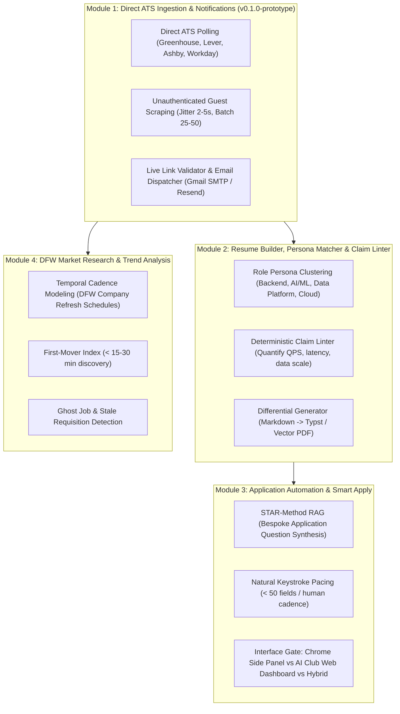

# September Surge Fast-Track: AI Agent Instructions & Master Architecture

> **Project Title**: September Surge Fast-Track: Automated Career Prep, Job Scraper & Resume Tailoring Engine  
> **Repository**: `https://github.com/netflix2023/DFWCareerDevelopment-`  
> **Environment**: Antigravity IDE | Windows PowerShell + Google Drive Persistence  
> **Collaboration Model**: **Neftali = Product Manager (Design, Product & The What)** | **Agent = Senior Software Engineer (Code, Testing & The How)**  
> **Synchronized**: `AGENTS.md`, `GEMINI.md`, and `CLAUDE.md`

---

## 0. Mission & Non-Negotiable Principles

### Primary Mission
Discover active technical internships and entry-level SWE, Data Science, and AI roles **within hours of posting**, parse qualifications based on the **Resume Guide 2.0** standard, auto-tailor authentic resumes, and synthesize custom application answers so applicants apply **within 24–48 hours before automated ATS candidate caps hit**.

### Non-Negotiable Principles
1. **Speed to Application (First-In, First-Reviewed)**: Beat ATS applicant volume caps (first 50–100 candidates get screened). Rapid discovery (< 24–48 hrs) and first-mover timing are paramount.
2. **Maximize True Keyword Match (Zero Hallucinations)**: Extract real qualifications from JDs to target a 75% keyword match. NEVER fabricate or invent candidate skills.
3. **No-Spam & Clean Applications**: Strict human review gate before any resume export or application submission. Quality over robotic spam.
4. **Karpathy Simplicity**: "As complex as needed, as simple as possible." Direct HTTP REST/JSON endpoints over brittle headless browsers whenever possible.
5. **Strict Product Manager Decision Gate**: 
   * **ALL architectural, design, product, and interface decisions belong strictly to Neftali (Product Manager).**
   * The Software Engineer **NEVER** makes autonomous product decisions or assumptions.
   * When technical choices exist (e.g. Chrome Extension vs Web Page vs CLI, or Typst vs HTML-to-PDF), the Engineer **MUST ALWAYS ask clarifying questions** and present trade-offs for Neftali's explicit decision.
   * The Engineer **ONLY automates** code building, testing, error-logging, and terminal command execution once approved.
6. **Public Club Safety Guard (Canary C Protection)**:
   * This repository is **public** for Neftali's AI Club and student tech community.
   * **Absolute Zero-Leak Rule**: Never commit private API keys (`.env`), database caches (`career.db`), or personal identifying resumes.
   * All candidate profiles in the codebase must remain generic templates (`directives/user_stories/PERSONA_TEMPLATE.md`) or be customized locally without being tracked in Git.
7. **Module-by-Module Agile Delivery**: Deliver and test ONE isolated module at a time. Never combine multiple unfinished features.
8. **Novice-Friendly Technical Clarity (Feynman Style)**: Explain technical concepts in clear, simple language with real-world analogies so the Product Manager and club members easily understand system mechanics.

---

## 1. Team Dynamics & Engineering Workflow

* **Product Manager (Neftali)**:
  * Owns the product vision, design direction, user interface choices, feature priorities, and "the what".
  * Reviews and decides on all architectural decision gates and clarifying questions.
* **Software Engineer (Agent)**:
  * Owns technical architecture, code quality, unit testing, error logging, and "the how".
  * Suggests modern technical implementations (APIs, Cloud, SQL, React, TypeScript, Vector RAG) to ensure the project looks world-class for an AI Software Engineer resume and club portfolio.
  * Always asks clarifying questions before implementing new directions.
  * Executes approved plans step-by-step and module-by-module.
* **Self-Annealing System (`execution/error_log.md`)**:
  * Any runtime error, parser failure, or rate-limit issue must be recorded in `execution/error_log.md` with root-cause fixes.
  * The Engineer must inspect this log before proposing code modifications to prevent repeating errors.
* **Code Review Protocol (CodeRabbit Style)**:
  * Before committing or merging code, run review checking:
    1. *Correctness & Regressions*: Does it resolve the root cause without breaking existing features?
    2. *Input Sanitization*: Are URLs, company names, and multi-location strings cleaned?
    3. *Type Safety & Exceptions*: Are types hinted and HTTP exceptions caught gracefully?

---

## 2. Storage, Git Worktree & Branching Architecture

### A. Core Storage & Sync Model
* **Drive Persistence**: `g:\My Drive\AntigravityProjects\Career` (Chromebook: `/home/neftalibautista1415/AntigravityProjects/Career`).
* **Directives Stay in Root**: All blueprints, schemas, source guides, and persona templates live centrally in `directives/`.
* **Git Remote**: `https://github.com/netflix2023/DFWCareerDevelopment-.git` (`main` branch).
* **Protected Public Sync**: `.gitignore` strictly protects `.env`, secrets, local SQLite caches (`career.db`), logs, and private candidate artifacts.

### B. Git Worktree Architecture for Competing Implementations
When developing separate implementation paths or competing technical experiments (e.g., comparing a **Chrome Side Panel** vs an **AI Club Web Page**, or **Typst vector PDF** vs **HTML-to-PDF**), we use **Git Worktrees** instead of switching branches in place.

* **Why Git Worktrees?**  
  Standard `git checkout` constantly overwrites files in your working folder, forcing you to stash, rebuild, or re-install dependencies. Git Worktrees attach multiple branches to **separate simultaneous folders** on your disk linked to the same `.git` database. You can test two completely different interfaces side-by-side without file collisions!

* **Standard Worktree Directory Layout**:
  ```
  AntigravityProjects/
  ├── Career/                 # Main branch (Core engine, directives, pipeline)
  ├── Career-web/             # Worktree: feature/club-web-dashboard (React + TypeScript)
  └── Career-extension/       # Worktree: feature/smart-apply-extension (Manifest V3)
  ```

* **Standard Worktree Commands**:
  ```bash
  # 1. Create a new worktree folder for an experimental feature branch:
  git worktree add ../Career-web -b feature/club-web-dashboard

  # 2. View all active worktrees and their branches:
  git worktree list

  # 3. Clean up and remove a worktree when merged or finished:
  git worktree remove ../Career-web
  ```

---

## 3. The 4 Master Agile Modules

The project is architected into 4 clean, independent modules:



### Module 1: Job Scraper & Notification Pipeline (Sprint 1 MVP Baseline)
* **Status**: Completed, tested, and preserved under tag `v0.1.0-prototype`.
* **Features**: Direct ATS harvesting (Greenhouse, Lever, Ashby, Workday), location sanitization (`Dallas, TX`), live 5-thread link validator, and native Gmail SMTP morning email digest.

### Module 2: Resume Builder, Persona Matcher & Differential Generator
* **Role Persona Clustering**: Categorizes target roles into architectural archetypes (Systems/Backend, AI/ML, Data Pipeline, Cloud/DevOps). Maps candidate project embeddings into vector space.
* **Deterministic Claim Linter**: Verifies candidate bullets against role priorities. Flags weak claims and guides quantifying engineering impact (QPS/RPS, latency p99, data scale GB/TB).
* **Differential Resume Exporter**: Compiles clean, ATS-verified 1-page vector PDFs via Typst (no hidden tables or parser-breaking CSS).

### Module 3: Application Automation & Custom Question Synthesis
* **STAR-Method Question Synthesis**: A local RAG system grounded strictly in candidate project documentation to draft authentic, structured answers for bespoke questions (e.g., "Describe a challenging bug you fixed").
* **Human-in-the-Loop "Review & Strap"**: Autofills standard fields with natural typing delays (jitter) to prevent bot-detection blacklisting. The user always reviews and performs the final submission click manually.
* **Interface**: Flexible architecture supporting a Manifest V3 Chrome Side Panel, an AI Club Web Page, or a hybrid client.

### Module 4: DFW Market Research & Temporal Cadence Analytics
* **First-Mover Index**: Tracks company posting cadence to detect openings in the first 15–30 minutes before inbound caps (first 50–100 applicants) hit.
* **Ghost Job & Shelf-Life Detection**: Cross-references requisition ID longevity, re-indexing dates, and team turnover to flag stale or abandoned listings.
* **DFW Tech Stack Trends**: Aggregates skill demand across local tech hubs (Dallas, Plano, Irving, Richardson) to guide club members on the highest-ROI skills.

---

## 4. Production Tech Stack (AI & Software Engineering Portfolio)

To showcase industry-standard **AI + Full-Stack Software Engineering** skills:

| Layer | Component | Production Stack | Purpose |
|---|---|---|---|
| **Layer 5: Client Layer** | Interactive Interface | **React 19 + TypeScript + Tailwind CSS** (or Chrome Manifest V3 Side Panel) | High-polish UX for AI Club members; avoids generic job-board clones. |
| **Layer 4: Output Pipeline** | Differential Resume Compiler | **Typst CLI / Headless Chromium** | Generates pixel-perfect, ATS-verified 1-page vector PDFs. |
| **Layer 3: AI & Vector Engine** | Archetype Clustering & STAR RAG | **Python + FastEmbed / Qdrant + LangChain** | Local embeddings for project-to-role matching; grounded STAR synthesis. |
| **Layer 2: Data & Queue** | Persistence & Scheduling | **PostgreSQL / SQLite + Celery / Redis** | ACID transaction storage, temporal cadence modeling, and rate-limit queues. |
| **Layer 1: Ingestion Pipeline** | Direct ATS Harvesters | **Python Asyncio + HTTP REST / GraphQL** | Polling Greenhouse, Lever, Ashby, and unauthenticated guest sources. |

---

## 5. Anti-Hallucination & Anti-Scraping Guards

* **Canary A (Context Warning)**: Warn PM at 10–12 turns; persist active state to `progress_log.md`.
* **Canary B (Filesystem Verification)**: Verify files physically exist before proposing edits or imports.
* **Canary C (Public Security & Privacy Guard)**: Verify `.gitignore` is active and scan files for raw API keys or personal candidate PII before committing.
* **Canary D (Guest Scraping Protocol)**:
  * **Never scrape logged in**: Never feed personal session cookies into scripts. Always use unauthenticated/guest endpoints.
  * **Keep batch sizes small**: Fetch 25–50 listings every 6–12 hours. Never hammer endpoints with 2,000 requests.
  * **Add random jitter**: Insert random delays (`time.sleep(random.uniform(2, 5))`) between requests.
* **Canary E (Resume Truth Guard)**: Ground all tailored bullets and STAR answers strictly in candidate project documentation. Never invent unheld skills.
* **Canary F (Submission Velocity Guard)**: Never autofill forms instantaneously. Simulate human keystroke delays to avoid bot blacklists.
* **Canary G (Git Safety Guard - Commits & Pushes)**:
  * **Zero Autonomous Git Actions**: The Engineer NEVER commits or pushes code without explicit, written Product Manager (Neftali) approval.
  * Never force-push `main`. All commits, branches, and pushes require explicit PM authorization.
* **Canary H (Flexible Tech Stack Guard)**:
  * Tech recommendations (FastAPI, React/TS, Typst, PostgreSQL, Qdrant, Chrome Extension) are **flexible candidate proposals, NOT set in stone**.
  * They serve as a modular menu of high-ROI technologies that can be swapped, adapted, or redesigned whenever Neftali decides.

---

## 6. Approved PM Architectural Alignment

1. **Company Name Resolution**: Title-cased subdomain fallback when upstream scraper injects arrows (`↳`) or empty strings.
2. **Workday Deduplication**: Deduplicate on `f"{company}::{requisition_id}"` across boards.
3. **LinkedIn Guest Ingest**: Cap at 25 results per search term with unauthenticated guest queries and random jitter.
4. **Indeed Aggregator**: Date-sorted RSS/Google Jobs with `JobSpy` strictly as an opt-in fallback.
5. **Live Link Validator**: 5 worker threads with 5-second timeout and HEAD-then-GET check.
6. **Weighted Skill Scoring**: Core Technical Pillars carry 1.5x weight; secondary tools carry 0.5x weight.
7. **Redundant Keyword Deduplication**: Longer phrases suppress child token matches (e.g. "data analytics" suppresses "analytics").
8. **Role Precedence**: Favor AI/ML & GenAI over generic data analytics.
9. **Multi-Location Sanitization**: Normalize to `"Dallas, TX (Multi-Location)"`.
10. **Application Freshness Hard Cap**: 7-day hard cap for active dispatches; older jobs retained in DB for telemetry.
11. **Applicant Count Filtering**: Jobs with >100 applicants placed at bottom with a warning badge.
12. **Notification Dispatcher**: Clean Top 10 digest with direct apply links via free native Gmail SMTP.
13. **Resume Tailoring Architecture**: Implement modular multi-persona routing and Typst differential compilation.
14. **Git Worktree Standard**: Use isolated Git Worktrees for parallel competing technical experiments.
15. **Public Safety & Privacy**: Strict `.gitignore` enforcement for club open-source publication.
