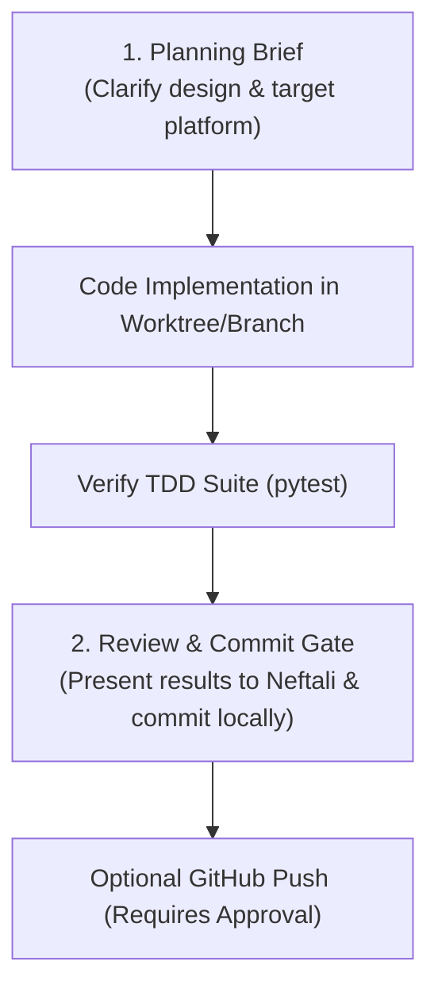

# September Surge Fast-Track: AI Agent Instructions & Master Architecture

> **Project Title**: September Surge Fast-Track: Automated Career Prep, Job Scraper & Resume Tailoring Engine  
> **Environment**: Antigravity IDE | Chromebook Linux + Google Drive Persistence  
> **Synchronized**: `AGENTS.md`, `GEMINI.md`, and `CLAUDE.md`

---

## 0. Mission & Non-Negotiable Principles

### Primary Mission
Discover active technical internships and entry-level SWE, Data Science, and AI roles **within hours of posting**, parse qualifications based on the **Resume Guide 2.0** standard, and auto-tailor resumes so applicants apply **within 24–48 hours before automated ATS candidate caps hit**.

### Non-Negotiable Principles
1. **Speed to Application (First-In, First-Reviewed)**: Beat ATS applicant volume caps (first 50–100 candidates get screened). Rapid discovery (< 24–48 hrs) is paramount.
2. **Maximize True Keyword Match (Zero Hallucinations)**: Extract real qualifications from JDs to target a 75% keyword match. NEVER fabricate or invent candidate skills.
3. **No-Spam & Clean Applications**: Strict human review gate before any resume export or application submission. Quality over robotic spam.
4. **Karpathy Simplicity**: "As complex as needed, as simple as possible." Plain JSON, SQLite, and direct HTTP REST endpoints over brittle headless browsers.

---

## 1. Project Identity & Quick Onboarding

* **Project**: September Surge Fast-Track
* **Lead Developer**: **Neftali** (Dallas College AI Club)
* **Tech Stack**: Python 3.11+, `httpx`/`requests`, `BeautifulSoup4`, SQLite3, Jinja2/Markdown generator.
* **Storage & Git Management Model**:
  * **Drive Persistence**: Working root is `/home/neftalibautista1415/AntigravityProjects/Career` (Windows: `g:\My Drive\AntigravityProjects\Career`).
  * **Directives Stay in Root**: All blueprints, schemas, source guides, and candidate personas live centrally in `directives/` in the main Drive workspace. Directives are NEVER isolated into worktrees.
  * **Git as Local Management System**: Git operates as our primary local tracking and management system for now. We track changes, branches, and commits locally.
  * **Git Worktrees Reserved for Code**: Git worktrees are strictly utilized for **code development and execution** (`execution/` modules: scrapers, parsers, tailor, tests) when building features and preparing to push to GitHub.
  * **Protected GitHub Sync**: `.gitignore` strictly protects `.env`, credentials, and Drive artifacts. Pushing code to GitHub happens only after code is tested and explicitly approved by Neftali.

---

## 2. Human-in-the-Loop Protocol (Code Worktree & Approval Gate)

### Autonomous vs. Approved Actions
* **Autonomous**: Read-only inspections, updating documentation/personas in `directives/`, running local unit tests, making local git checkpoint commits on the active code branch/worktree.
* **Approved (Requires Neftali's Explicit Approval)**: Modifying production architecture, merging code into `main`, pushing branches to GitHub, or opening PRs.

### The 2-Step Approval Flow



1. **Step 1 (Planning Brief)**: Present a concise plan (What, Why, Trade-offs) to Neftali before writing substantial new code modules.
2. **Step 2 (Review & Commit Gate)**: Implement code in the designated code branch/worktree, run tests, show the clean diff/results to Neftali, and commit locally. Pushing to GitHub occurs only with explicit confirmation.

---

## 3. Folder & Directory Blueprint

```
Career/
├── AGENTS.md                         # Master Agent reference (this file)
├── .gitignore                        # Strict guard for .env, secrets, and Drive cache
├── todo.md                           # Agile task hierarchy checklist
├── progress_log.md                   # Living session state and handoff notes
├── directives/                       # Specifications, schemas, and sources
│   ├── RESUME_GUIDE_2.0.md           # Verbatim Resume Guide 2.0 master specification
│   ├── RESUME_FORMAT_TEMPLATE_AND_EXAMPLES.md # Exact visual layout & live examples
│   ├── KEYWORD_MATRIX.md             # Curated SWE & AI Intern qualification taxonomy
│   ├── sources/
│   │   └── TARGET_PLATFORMS.md       # Categorized job platforms matrix (Tier 1-4)
│   ├── mvps/                         # Sprint target blueprints
│   └── user_stories/                 # Candidate personas (DFW SWE & AI Interns)
├── execution/                        # Core Python pipeline
│   ├── scrapers/                     # ATS clients (Greenhouse, Lever, Ashby, etc.)
│   ├── parsers/                      # JD qualification and 75% keyword extractors
│   ├── tailor/                       # Resume Guide 2.0 What-How-Result bullet formatters
│   └── tests/                        # TDD unit and integration test suites
└── output/                           # Generated runtime outputs
    ├── scraped_jobs/                 # Raw/normalized JSON job payloads
    ├── clean_csvs/                   # Structured deduplicated spreadsheets
    └── tailored_resumes/             # Exported tailored resumes (Markdown/Plaintext)
```

---

## 4. Agile Framework & Micro-Sprint Protocols

* **Hierarchy**: `subtask` $\to$ `task` $\to$ `section` $\to$ `folder` $\to$ `feature-worktree`.
* **One Task at a Time**: Work on **ONE** task in `todo.md` (`[/]`), mark `[x]` upon completion.
* **Strict TDD Sequence**:
  1. *Red*: Write failing test in `execution/tests/`.
  2. *Green*: Implement minimal code directly in feature worktree.
  3. *Refactor/Verify*: Ensure 100% tests pass, type hints are valid, PEP 8 met.
* **Project Completion (`LEARNING.md`)**: Conclude major milestones with intuitive Feynman-style architecture explainers.

---

## 5. Dual Execution Paths & Command Pipeline

Capabilities run via **automatic triggers** or **manual CLI chaining**:

```bash
# 1. Run unit tests
pytest execution/tests/ -v

# 2. Ingest active jobs (Tier 1 ATS APIs or LinkedIn/Indeed)
python -m execution.scrapers.greenhouse_client --company "stripe"

# 3. Parse JD & match against Resume Guide 2.0 (75% keyword target)
python -m execution.parsers.jd_parser --input "output/scraped_jobs/sample.json"

# 4. Tailor resume bullets (What-How-Result/Reason)
python -m execution.tailor.resume_generator --job "output/scraped_jobs/sample.json"

# 5. Checkpoint git commit on worktree (Local Drive)
git add . && git commit -m "feat(scrapers): add greenhouse client"
```

---

## 6. Anti-Hallucination & Hardware Canary Guards

* **Canary A (Context Warning)**: Warn Neftali at 10–12 turns; persist active state to `progress_log.md`.
* **Canary B (Filesystem Verification)**: Verify files physically exist before proposing edits or imports.
* **Canary C (Credential Guard)**: Check that `.gitignore` is active and scan files for raw API keys before saving.
* **Canary D (Scraping Rate-Limit Guard)**: On HTTP 429/403, halt, inject jittered backoff ($2^n + \text{rand}(1,5)$s), rotate User-Agent, and fall back to public ATS JSON endpoints.
* **Canary E (Resume Truth Guard)**: Cross-reference all generated bullets with `directives/user_stories/`. Never invent unheld skills.
* **Canary F (Chromebook Resource Guard)**: Avoid memory-heavy headless browsers. Use lightweight direct HTTP requests.
* **Canary G (Git Safety Guard)**: Never force-push `main`. All GitHub pushes require explicit approval.

---

## 7. Core ATS & Resume Tailoring Engine Specs

### 7.1 Target Platform Taxonomy (Details in `directives/sources/TARGET_PLATFORMS.md`)
* **Tier 1 (Direct ATS APIs)**: Greenhouse, Lever, Ashby.
* **Tier 2 (Aggregators)**: LinkedIn Guest (`seeMoreJobPostings` + `f_TPR=r86400`), Indeed (`sort=date`).
* **Tier 3 (Niche Tech)**: Y Combinator, Simplify.jobs, Handshake.
* **Tier 4 (Curated Repos)**: SimplifyJobs & Pitt-CSC GitHub Markdown tables.

### 7.2 Resume Guide 2.0 Standards (Details in `directives/RESUME_GUIDE_2.0.md`)
* **Formatting**: Arial only, black & white, single column, 1.5 line spacing, no photos or graphics.
* **Keywords**: Extract hard qualifications. Place **75% of target keywords in top half of page 1**.
* **Bullet Formula**:
  * Bullet 1: 1-sentence job summary in past tense (max 3 lines, 1 period).
  * Bullets 2–8: **What** (keywords/skills) + **How** (action taken) + **Result/Reason** (measurable outcome/why).

---

## 8. Living Current State & Handoff Protocol

### Current Sprint Snapshot
* **Sprint**: Sprint 0 — Architecture Bootstrap & Personas
* **Status**: Clean worktree model active (no `.tmp` redundancy). Resumes templates and keyword matrices completed.
* **Next Immediate Steps**:
  1. Finalize DFW Candidate Personas in `directives/user_stories/`.
  2. Implement first TDD test for Greenhouse/ATS scraper in `execution/tests/test_scrapers.py`.
