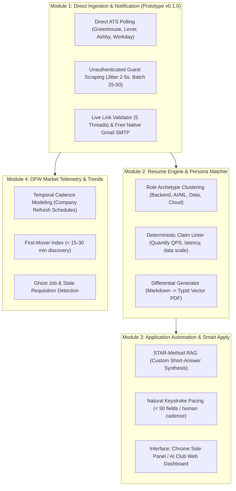

# DFW Career Development Engine (September Surge Fast-Track)

[]()
[]()
[](LICENSE)
[](https://github.com/netflix2023/DFWCareerDevelopment-/releases/tag/v0.1.0-prototype)

> **High-Velocity Career Discovery, Resume Tailoring & Application Intelligence Engine**  
> Built for students, club members, and early-career developers targeting **Software Engineering (SWE), Artificial Intelligence (AI/ML), and Data Science** roles in the Dallas–Fort Worth metroplex and remote US markets.

---

## 🚀 The Mission: Beating the ATS Volume Cap

In modern technical recruiting, top internship and entry-level positions receive hundreds of applications within the first 48 hours. Most applicant tracking systems (Greenhouse, Lever, Workday) cap incoming review batches after the first **50–100 candidates**.

**DFW Career Development Engine** solves this problem through:
1. **First-In Discovery**: Discovering direct company career postings within hours using direct public endpoints.
2. **True Keyword Grounding**: Matching authentic candidate project skills to job requirements targeting a 75% ATS match without hallucinated fluff.
3. **Smart Apply Assistance**: Synthesizing grounded STAR-method answers for bespoke application questions with human-in-the-loop review.
4. **Market Intelligence**: Tracking posting cadences and detecting ghost jobs across the DFW ecosystem.

---

## 🧩 The 4 Core Agile Modules



### Module Overview
| Module | Focus Area | Status | Tech Stack |
|---|---|---|---|
| **Module 1** | Direct ATS Ingestion & Notifications | 🟢 **Completed** (`v0.1.0-prototype`) | Python Asyncio, HTTP REST, SQLite, Gmail SMTP |
| **Module 2** | Resume Builder & Persona Matcher | 🟡 **Active Sprint** | Typst CLI, FastEmbed, Vector Clustering |
| **Module 3** | Smart Apply & Custom Question RAG | ⚪ Upcoming Phase | Manifest V3 Extension / React 19 + TypeScript, LangChain |
| **Module 4** | DFW Market Intelligence & Trends | ⚪ Upcoming Phase | Pandas, SQL Analytics, Telemetry Tracker |

---

## 🛠️ Production Tech Stack

To reflect industry-standard full-stack AI and software engineering practices:

- **Frontend & Client**: React 19, TypeScript, Tailwind CSS, Chrome Manifest V3 Side Panel
- **Backend & APIs**: Python 3.11, FastAPI, Asyncio, REST & GraphQL
- **Data & Vector Persistence**: PostgreSQL, SQLite, pgvector / Qdrant, Redis
- **Output Compilation**: Typst vector compiler (ATS-verified clean PDFs)
- **Quality & Automation**: CodeRabbit AI Review, GitHub Actions CI

---

## 🌳 Git Worktree Architecture for Parallel Experiments

When building competing implementations (e.g. testing an **AI Club Web Page** alongside a **Chrome Side Panel**, or **Typst** vs **HTML-to-PDF**), this project utilizes **Git Worktrees** to run multiple branches simultaneously in separate folders without git stash conflicts.

```bash
# 1. Create a dedicated worktree folder for an experimental feature:
git worktree add ../Career-web -b feature/club-web-dashboard

# 2. List all active worktrees:
git worktree list

# 3. Remove a worktree after merging:
git worktree remove ../Career-web
```

---

## 🔒 Security, Safety & Open Source Privacy

This repository is public for the tech club and community:
- **Zero-Leak Guarantee**: `.env` API keys, database files (`*.db`), and personal candidate resumes are strictly ignored by `.gitignore`.
- **Customizable Personas**: Club members can create their own profile using [`directives/user_stories/PERSONA_TEMPLATE.md`](directives/user_stories/PERSONA_TEMPLATE.md) without checking personal data into Git.

---

## 🚦 Quickstart (Running Module 1 Pipeline)

1. **Clone the repository**:
   ```bash
   git clone https://github.com/netflix2023/DFWCareerDevelopment-.git
   cd DFWCareerDevelopment-
   ```

2. **Configure Environment**:
   ```bash
   copy .env.example .env
   # Add your Gmail App Password or API keys if sending email digests
   ```

3. **Run the ATS Ingestion & Link Validator Pipeline**:
   ```bash
   python execution/prototype/scrapers/pipeline.py
   ```

---

## 📄 License & Community
Maintained by the Student AI Club & Engineering Community. Distributed under the MIT License.