# Career Surge Engine: Future Roadmap & Master Architecture Plan

> **Document Status**: Stored Blueprint for Future Implementation (Phase 2 & Phase 3)  
> **Location**: `directives/FUTURE_ROADMAP_AND_ARCHITECTURE_PLAN.md`  
> **PM Approval**: Approved by Neftali  
> **Phase 1 State**: Fully Built, Tested, Audited, and Committed locally on `main` (Commit `f8aa482`)

---

## 1. Executive Strategy & Architectural Pillars

The Career Surge Engine is designed around three foundational architectural pillars to overcome the fatal flaws of modern job hunting:

```mermaid
flowchart TD
    subgraph Pillar 1: Ingestion & Market Timing Arbitrage
        P1A["Direct ATS JSON Polling (Greenhouse, Lever, Ashby)"] --> P1B["First-Mover Index & Temporal Cadence Modeling"]
        P1B --> P1C["Ghost Job & Abandoned Requisition Detection"]
    end

    subgraph Pillar 2: Tailoring Personas Beyond Keyword Stuffing
        P2A["Role Persona Clustering (Vector Embeddings)"] --> P2B["Deterministic Semantic Claim Linter"]
        P2B --> P2C["Differential Resume Generation (Typst / HTML-to-PDF)"]
    end

    subgraph Pillar 3: Smart Apply Architecture Over Blind Automation
        P3A["Human-in-the-Loop Review-and-Strap (Manifest V3 Extension)"] --> P3B["STAR-Method RAG for Bespoke Custom Questions"]
        P3B --> P3C["Natural Keystroke Pacing & Human Final Submit"]
    end
```



---

## 2. The 5-Layer Production Target Stack

| Layer | System Component | Tooling & Implementation Strategy |
|---|---|---|
| **Layer 5: Client Layer** | Smart Apply Assistant | Manifest V3 Chrome Extension (`feature/smart-apply-extension`) with form field mapping, natural keystroke timing, and human final-click approval to prevent bot blacklisting. |
| **Layer 4: Output Pipeline** | Differential Resume Compiler | Dual feature branches: Typst vector compiler (`feature/resume-typst`) vs Headless Chromium (`feature/resume-html-pdf`) producing clean, ATS-verified PDFs. |
| **Layer 3: Parsing & Vector Engine** | Archetype Clustering & Linter | Dual feature branches: Local FastEmbed / sentence-transformers (`feature/vector-fastembed`) vs Persistent Qdrant / pgvector (`feature/vector-qdrant`) + STAR-method RAG retriever. |
| **Layer 2: Data & Queue** | Persistence & Scheduling | Current: Local SQLite `career.db` with ACID deduplication and `discovered_at` immutability. Future scale: PostgreSQL + Celery/Redis for enterprise rate-limit queues. |
| **Layer 1: Ingestion Pipeline** | Direct ATS Harvesters | Python Asyncio + `BaseHarvester` adapters: `MarkdownFeedHarvester` (active), `AshbyApiHarvester` (GraphQL), `GreenhouseApiHarvester` (JSON REST), and `WorkdayApiHarvester`. |

---

## 3. Feature Branching Roadmap (Execution Strategy)

Whenever work resumes on future phases, development will proceed in isolated feature branches to keep `main` perpetually releasable:

```
main (stable, audited Phase 1 engine)
  │
  ├──► feature/github-sync-coderabbit
  │      └── Connect remote origin, push main, and install official CodeRabbit GitHub App.
  │
  ├──► feature/resume-typst
  │      └── Integrate Typst CLI to compile ATS-verified single-page vector PDFs.
  │
  ├──► feature/resume-html-pdf
  │      └── Alternative PDF compiler using modern Tailwind/HTML templates via Headless Chromium.
  │
  ├──► feature/vector-fastembed
  │      └── Local offline sentence-transformers vector embeddings for project-to-role matching.
  │
  ├──► feature/vector-qdrant
  │      └── Dockerized Qdrant vector database integration for large-scale embedding storage.
  │
  ├──► feature/smart-apply-extension
  │      └── Manifest V3 Chrome Extension for safe autofill and human review on ATS forms.
  │
  └──► feature/cloud-automation
         └── GitHub Actions workflow (.github/workflows/daily_pipeline.yml) running daily at 7:00 AM CDT.
```

---

## 4. Phase 2 Implementation Modules (Next Sprint Objectives)

### Module 7: Multi-Persona Resume Tailoring Engine
1. **Persona Clustering**:
   - Categorize active positions from `career.db` into 4 archetypes:
     - `Systems & Backend` (Python, C++, Go, Docker, APIs, Concurrency, Linux)
     - `AI/ML & GenAI` (PyTorch, RAG, Vector DBs, FastAPI, LLM Fine-Tuning)
     - `Data Platform & Analytics` (SQL, ETL, Snowflake, Spark, Pandas, Data Modeling)
     - `Cloud & DevOps` (Kubernetes, Terraform, AWS/GCP, CI/CD, Observability)
2. **Semantic Claim Linter**:
   - Deterministic verification checking candidate bullets against role priorities.
   - Prompts to quantify metrics: **throughput (QPS/RPS)**, **latency (p99/ms)**, and **data scale (GB/TB)**.
3. **Differential Resume Exporter**:
   - Generates tailored resumes in clean Markdown (`output/resumes/<company>_<job_id>.md`) and compiles to PDF via Typst.

### Module 8: Cloud Automation & GitHub Sync
1. Generate fresh GitHub Personal Access Token (classic) with `repo` scope.
2. Link remote: `git remote add origin https://github.com/netflix2023/career-surge-engine.git`
3. Push `main` and install the official [CodeRabbit AI](https://coderabbit.ai/) GitHub App.
4. Deploy `.github/workflows/daily_pipeline.yml` configured for 7:00 AM CDT daily execution.

---

## 5. Phase 3 Implementation Modules (Advanced Production Scaling)

### Module 9: Market Timing Arbitrage & Temporal Analytics
1. **Direct ATS API Ingestion**: Direct polling of public JSON endpoints (`boards-api.greenhouse.io`, `api.lever.co`, Ashby GraphQL).
2. **First-Mover Index**: Compute company posting cadence to detect openings in the first 15–30 minutes before inbound caps.
3. **Ghost Job Detection**: Flag stale listings that remain open without active hiring.

### Module 10: Human-in-the-Loop "Smart Apply" Extension
1. Manifest V3 Chrome Extension with natural keystroke timing.
2. Local STAR-method RAG grounded in candidate project documentation for custom essay prompts.
3. User approval button for final submission.

---

## 6. How to Resume This Project on Another Day

When you are ready to resume, follow these steps:
1. Review [`directives/FUTURE_ROADMAP_AND_ARCHITECTURE_PLAN.md`](file:///g:/My%20Drive/AntigravityProjects/Career/directives/FUTURE_ROADMAP_AND_ARCHITECTURE_PLAN.md).
2. Read the non-technical concepts in [`docs/FEYNMAN_TECHNICAL_EXPLAINER.md`](file:///g:/My%20Drive/AntigravityProjects/Career/docs/FEYNMAN_TECHNICAL_EXPLAINER.md).
3. Check active sprint state in [`progress_log.md`](file:///g:/My%20Drive/AntigravityProjects/Career/progress_log.md) and [`todo.md`](file:///g:/My%20Drive/AntigravityProjects/Career/todo.md).
4. Supply your GitHub token to sync `main`, or pick the first feature branch (e.g. `feature/resume-typst`) to begin development!
