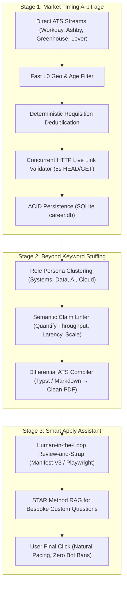

# Career Surge Engine: Architecture Explainer, MVP Scope & Definition of Done (DoD)

> **Document Version**: 1.0.0  
> **Location**: `directives/mvps/MVP_SPECIFICATION_AND_DOD.md`  
> **System Name**: `career-surge-engine`  
> **Product Manager**: Neftali | **Software Engineer**: AI Agent  
> **Mission**: Eliminate job search latency, bypass stale aggregators, and generate authentic, ATS-compliant application packages using direct ATS intelligence and smart human-in-the-loop workflows.

---

## 1. Executive Summary & Feynman Explainer

### The Core Problem
Most job seekers apply to job boards (LinkedIn, Indeed) hours or days after a requisition opens, competing against 500+ applicants who flooded the inbound queue. Furthermore, generic "auto-apply" bots submit low-quality, keyword-stuffed resumes that either fail ATS parsers or get blacklisted by enterprise rate limiters.

### The Career Surge Solution (Explained Simply)
Think of the Career Surge Engine as a **3-stage intelligence factory**:



1. **Stage 1 (Find First)**: We listen directly to corporate ATS endpoints before syndication. If Boeing, RTX, or an AI startup posts a role, we catch it within minutes, drop closed roles, and record it in `career.db`.
2. **Stage 2 (Tailor Deeply)**: Instead of injecting random buzzwords, we cluster roles into architectural archetypes (Systems, AI, Data Platform). We verify the candidate's existing portfolio and use Typst/Markdown to generate clean, ATS-verified PDFs without broken formatting.
3. **Stage 3 (Smart Apply)**: Rather than an auto-submit bot that triggers Cloudflare or Workday anti-bot bans, a smart assistant pre-fills forms and drafts STAR-method answers to custom essay questions, leaving the final click to the user with natural keystroke timing.

---

## 2. Granular Audit: What Is Done vs. What Is Not Done

| Architectural Component | Neftali's Strategic Suggestion | Current Status | Details & Implementation Location |
|---|---|---|---|
| **Direct ATS Ingestion** | Poll primary ATS sources (`myworkdayjobs.com`, `ashbyhq.com`, `greenhouse.io`) directly rather than scraped third-party syndication. | **DONE** | [`pipeline.py`](file:///g:/My%20Drive/AntigravityProjects/Career/execution/scrapers/pipeline.py) + [`base_harvester.py`](file:///g:/My%20Drive/AntigravityProjects/Career/execution/scrapers/base_harvester.py) ingests 4 streams (2027, 2026, 2025, New Grad). 67 active direct ATS positions harvested. |
| **Direct ATS API Endpoints** | Direct JSON endpoints (`boards-api.greenhouse.io`, `api.lever.co`, Ashby GraphQL). | **NOT DONE (Phase 2)** | `BaseHarvester` interface created; `AshbyApiHarvester` and `GreenhouseApiHarvester` stubs ready for Phase 2 API polling. |
| **Requisition Deduplication** | Collapse duplicate listings across internal sub-boards (e.g. Boeing `EXTERNAL_CAREERS` vs `INTERN`). | **DONE** | [`url_utils.py`](file:///g:/My%20Drive/AntigravityProjects/Career/execution/scrapers/url_utils.py#L124-L138) hashes `(company, req_id or title)` without variable URLs. Merges secondary links into `alternate_urls`. |
| **Early Filtering Optimization** | Skip non-metro and old postings before heavy URL parsing/regex. | **DONE** | [`pipeline.py`](file:///g:/My%20Drive/AntigravityProjects/Career/execution/scrapers/pipeline.py#L105-L125) filters 4,324 candidates down to ~70 in milliseconds. |
| **Dynamic Geographic Scope** | Scope easily changeable from DFW to Austin, Remote, or All. | **DONE** | Decoupled in [`geo_config.py`](file:///g:/My%20Drive/AntigravityProjects/Career/execution/scrapers/geo_config.py) via single `TARGET_METRO` variable in `.env`. |
| **Concurrent Live Link Health** | Fast HTTP checks with closed-job keyword scanning to drop 404s. | **DONE** | [`link_validator.py`](file:///g:/My%20Drive/AntigravityProjects/Career/execution/scrapers/link_validator.py) with 5 worker threads, 5s timeout, and closed-phrase parsing. |
| **Persistent Storage & Telemetry** | SQLite `career.db` with immutable `discovered_at` and lifecycle tracking. | **DONE** | [`database.py`](file:///g:/My%20Drive/AntigravityProjects/Career/execution/storage/database.py) with `jobs`, `job_telemetry`, and `applications` tables. |
| **Daily Link Maintenance Routine** | Automated process to prune broken/closed URLs daily. | **DONE** | [`link_maintenance.py`](file:///g:/My%20Drive/AntigravityProjects/Career/execution/storage/link_maintenance.py) iterates active jobs, marks `is_active = 0`, and calculates `days_to_close`. |
| **Temporal Trend Analytics** | Track posting cadence by company/metro ("First-Mover Index"). | **NOT DONE (Phase 2)** | Schema has `job_telemetry`; predictive posting cadence modeling planned for Phase 2. |
| **"Ghost Job" Detection** | Flag stale postings by re-indexing dates and longevity. | **PARTIAL** | Pipeline drops postings $> 7$ days old; historical abandonment cross-referencing planned for Phase 2. |
| **Role Persona Clustering** | Cluster target roles into distinct architectural archetypes. | **PARTIAL** | Persona guides created (`PERSONA_AI_ENGINEER_INTERN_DFW.md`, `PERSONA_SWE_INTERN_DFW.md`); automated vector clustering is Phase 2. |
| **Semantic Claim Linter** | Deterministic linter flagging weak claims (quantifying throughput, latency, scale). | **NOT DONE (Phase 2)** | Deferred to Module 7. |
| **Differential Resume Generation** | Compile ATS-compliant Markdown/Typst templates into clean PDFs. | **NOT DONE (Phase 2)** | Deferred to Module 7. |
| **Smart Apply Assistant** | Human-in-the-loop assistant with natural keystroke timing. | **NOT DONE (Phase 3)** | Planned for Phase 3 (Client Layer). |
| **Custom Question Synthesis** | STAR-method RAG grounded in candidate portfolio for custom essay questions. | **NOT DONE (Phase 3)** | Planned for Phase 3. |
| **Daily Email Digest (Gmail)** | Morning Top 10 email digest with 1-click apply buttons. | **PARTIAL** | [`email_dispatcher.py`](file:///g:/My%20Drive/AntigravityProjects/Career/execution/notifier/email_dispatcher.py) built with responsive HTML and native Gmail SMTP; awaiting Google App Password in `.env` to send over network. |
| **External Code & Design Review** | Genuine external CodeRabbit AI review on PRs + Ruff/Mypy. | **NOT DONE (Awaiting GitHub Sync)** | Self-made script rejected; CodeRabbit GitHub App integration planned upon repo push. |
| **Cloud Automation** | Daily GitHub Actions workflow at 7:00 AM CDT. | **NOT DONE (Phase 2)** | Awaiting GitHub remote connection. |

---

## 3. Definition of Done (DoD)

### Phase 1: Prototype MVP (COMPLETED & VERIFIED)
- [x] Ingest from multiple live ATS streams with parent company inheritance.
- [x] Early geographic and age filtering ($\le 7$ days).
- [x] Deterministic deduplication by `(company, req_id or title)` collapsing internal sub-boards.
- [x] Concurrent HTTP live link validation with closed-job detection.
- [x] Persistent SQLite database (`career.db`) with immutable `discovered_at` dates.
- [x] Automated daily link maintenance script to prune dead URLs.
- [x] Responsive HTML email digest with 1-click apply buttons and native Gmail SMTP support.
- [x] 100% clean unit tests (11/11 passing across URL utils, matcher, and validator).

### Phase 2: Resume Tailoring & Cloud Automation (CURRENT SPRINT)
- [ ] Connect remote GitHub repository (`netflix2023/career-surge-engine`) and sync `main`.
- [ ] Install official **CodeRabbit GitHub App** for automated AI code and architectural design review on Pull Requests.
- [ ] Add `GMAIL_APP_PASSWORD` to `.env` and verify live email delivery in `neftalibautista1415@gmail.com`.
- [ ] Implement **Module 7 (Multi-Persona Resume Tailoring)**:
  - Role clustering into archetypes (AI/ML, Systems/SWE, Data Platform).
  - Semantic claim verification (highlighting and quantifying metrics).
  - Typst / Markdown compilation into clean, ATS-verified PDF resumes.
- [ ] Implement **Module 8 (Cloud Automation)**:
  - GitHub Actions cron workflow running daily at 7:00 AM CDT.
- [ ] Implement direct ATS API adapters (`AshbyApiHarvester`, `GreenhouseApiHarvester`).

### Phase 3: Smart Apply & Market Timing Arbitrage (PRODUCTION STACK)
- [ ] First-Mover Index & Temporal Trend Analytics (predictive company posting cycles).
- [ ] Ghost job & shelf-life detection algorithms.
- [ ] Manifest V3 Chrome Extension or Playwright Review-and-Strap assistant.
- [ ] STAR-method RAG for bespoke application essay questions.
- [ ] Migration from SQLite to PostgreSQL + pgvector / Qdrant + Celery.

---

## 4. 5-Layer Target Architecture Stack

```
+-------------------------------------------------------------------------+
| Layer 5: Client Layer (Manifest V3 Chrome Extension / Review-and-Strap) |
|          Natural typing pacing, form pre-fill, human final-click        |
+-------------------------------------------------------------------------+
                                    |
+-------------------------------------------------------------------------+
| Layer 4: Output Pipeline (Typst / ATS-Verified PDF Exporter)            |
|          Pixel-perfect rendering, zero hidden CSS/tables, clean text    |
+-------------------------------------------------------------------------+
                                    |
+-------------------------------------------------------------------------+
| Layer 3: Parsing & Vector Engine (Qdrant / FastEmbed / STAR RAG)        |
|          Archetype clustering, claim linter, custom question synthesis  |
+-------------------------------------------------------------------------+
                                    |
+-------------------------------------------------------------------------+
| Layer 2: Data & Queue (PostgreSQL + Celery / Redis / SQLite Prototype)  |
|          ACID indexing, immutable discovered_at, First-Mover Index      |
+-------------------------------------------------------------------------+
                                    |
+-------------------------------------------------------------------------+
| Layer 1: Ingestion Pipeline (Python Asyncio / Direct ATS JSON APIs)     |
|          Greenhouse, Lever, Ashby, Workday REST & public feed tables    |
+-------------------------------------------------------------------------+
```
