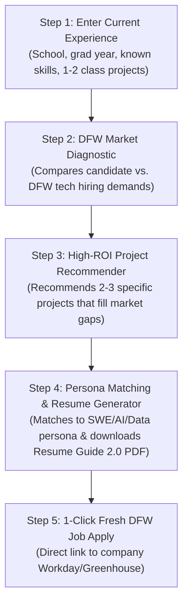

# DFW Career Development Engine: MVP Specification & Web Architecture

> **Document Type**: Master MVP Product Specification  
> **Product Owner**: **Neftali (Product Manager)** | **Engineer**: **AI Agent**  
> **Status**: Pure Design & Planning Phase (Zero Code / Zero Scripts)  
> **Core Requirement**: **The MVP MUST be a Web Page (accessible via browser with zero friction).**

---

## 1. The Core Decision: What Kind of Web Page Should This Be?

To make this effortless for your AI club members, we need a web interface so students never have to touch a command prompt or install Python dependencies on their machines.

Here are the two ways we can deliver this web page:

```
                  ┌────────────────────────────────────────────────────────┐
                  │                 The Web Page Options                   │
                  └───────────┬────────────────────────────────┬───────────┘
                              │                                │
                 ┌────────────▼──────────────┐   ┌─────────────▼─────────────┐
                 │  Option A: Interactive    │   │  Option B: Full-Stack     │
                 │    Client-Side Web App    │   │   Web App (API Backend)   │
                 │   (Static / GitHub Pages) │   │     (React + FastAPI)     │
                 └───────────────────────────┘   └───────────────────────────┘
```

### Option A: Interactive Client-Side Web App (Fastest, 100% Free Hosting)
* **How it works**: A fast, responsive web application (HTML5/Vanilla JS or React/Vite) that runs **entirely in the user's browser**.
* **Job Feed Data**: Consumes a daily pre-compiled JSON feed generated by our ingestion pipeline.
* **Resume Generation**: Compiles the candidate's resume directly in the browser into a downloadable, single-column Arial PDF or Word document.
* **Hosting**: Can be hosted for **$0 forever** on **GitHub Pages** (e.g. `netflix2023.github.io/DFWCareerDevelopment-`) or **Vercel**.
* **Pros**: Club members don't have to install or host anything. They just visit the website on their phone or laptop.

---

### Option B: Full-Stack Web App with Backend (React + FastAPI)
* **How it works**: A React web page on the frontend connected to a Python FastAPI server running in the background.
* **Resume Generation**: The browser sends user data to the backend API, where Python/Typst compiles the PDF and streams it back.
* **Hosting**: Requires running both a frontend server and a backend container (Render, Railway, or AWS).
* **Pros**: Supports real-time heavy AI processing, background database syncs, and large vector storage.

---

## 2. The Step 1 User Journey on the Web Page

Here is exactly what a club member experiences on this web page:



### 1. Simple Onboarding ("My Background")
* The student opens the web page.
* They check off what they know (e.g., *Python, SQL, Git*) and paste 1–2 class projects.
* They choose their target career track: **Software Engineering Intern**, **AI/ML Intern**, or **Data Analyst**.

### 2. DFW Market Gap Diagnostic
* The web page compares their skills against what the **Dallas–Fort Worth market actually demands**:
  * **Fintech/Enterprise (Plano/Westlake)**: Flags if they are missing *SQL, Spring Boot, or REST APIs*.
  * **Defense/Systems (Fort Worth/Dallas)**: Flags if they are missing *C++, Linux, or OOP principles*.
  * **Applied AI (Richardson/Dallas)**: Flags if they are missing *FastAPI, RAG, PyTorch, or Docker*.
* Shows a clear **Market Match Score** (e.g., `68% Match to DFW SWE Internships`).

### 3. High-ROI Project Recommendations
* Instead of leaving the student stuck, the web page gives them **exact project blueprints** tailored to early-career candidates:
  * *Example for SWE*: "Build a REST API in FastAPI with PostgreSQL indexed queries that loads 5,000 items in <200ms."
  * *Example for AI*: "Build a document search system using LangChain and vector embeddings with factual grounding."
* Gives them bullet point templates using the **What-How-Result** formula.

### 4. Persona Matching & 1-Click Resume Generator
* Routes the candidate to the best-matching archetype (Systems, AI Engineer, or Data).
* Generates an authentic, single-column **Resume Guide 2.0 standard PDF**:
  * Clean black-and-white Arial format.
  * 75% of target qualifications placed in the top half of page 1.
  * Zero hallucinated claims.
  * 1-click **"Download PDF"** and **"Download Word (.docx)"**.

### 5. Fresh DFW Job Feed
* Displays active DFW internships and new grad postings ($\le 7$ days old) with working direct links.
* Club members click "Apply" and submit with their freshly tailored resume in under 3 minutes.

---

## 3. Product Manager Decision Gate

Neftali, to lock in the web page architecture for our MVP:

1. **Hosting & Architecture**:
   - Would you prefer **Option A (Client-Side Static Web App on GitHub Pages / Vercel — instant, $0 cost, zero servers to manage)**, or **Option B (Full-Stack React + Python FastAPI backend)**?
2. **First Web Page Screen**:
   - Should the web page open directly to the **DFW Job Feed** (with a "Tailor My Resume" button on top), or start with a **"Career Diagnostic / Resume Builder" questionnaire**?
